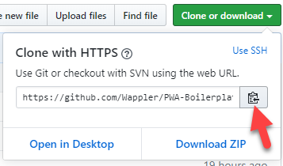
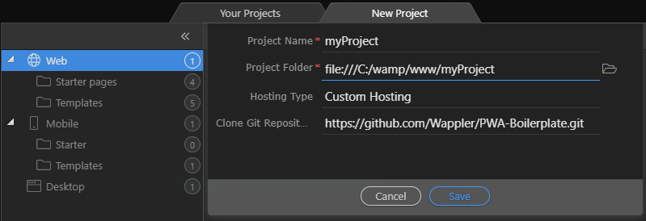
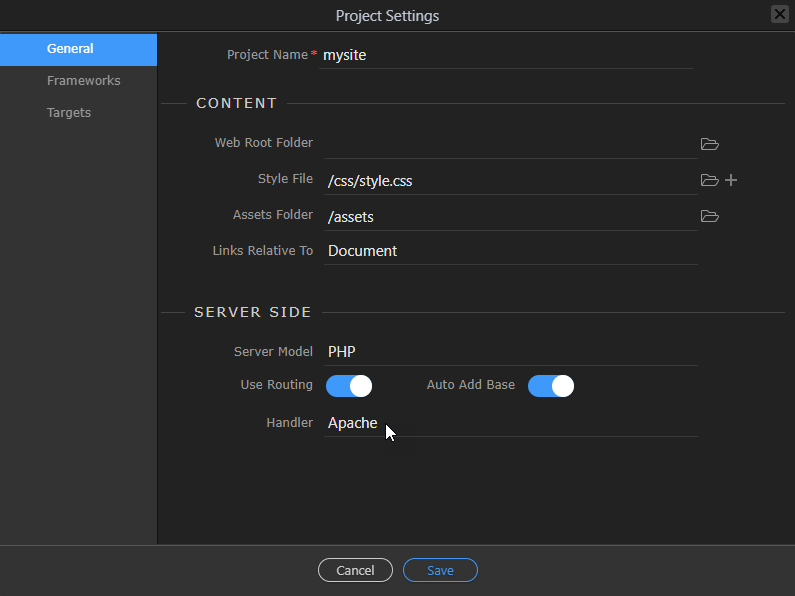
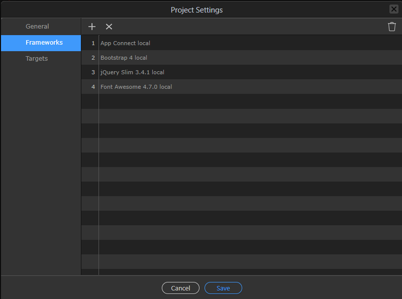
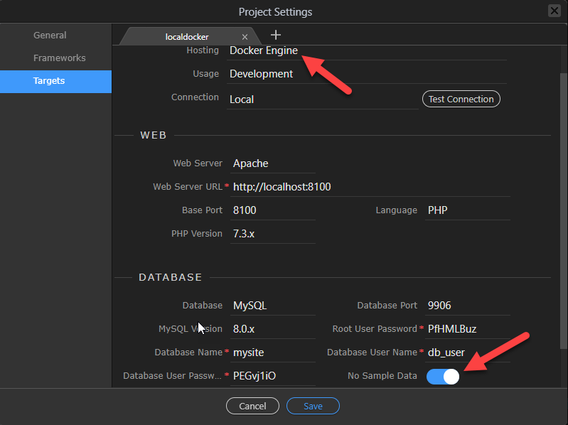
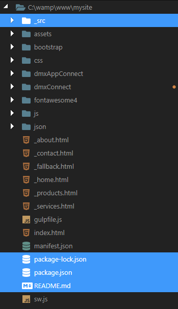

# Starter-Boilerplate
An easy to use boilerplate to kickstart your Wappler project

## Installation
1. Copy the URL

1. Create a new project
    1. make sure to choose Docker Hosting 

1. Make sure to set the following Project Settings

### If you do not wish to use Bootstrap theming:
1. Delete the following files and folder

Please enjoy!
Ben
